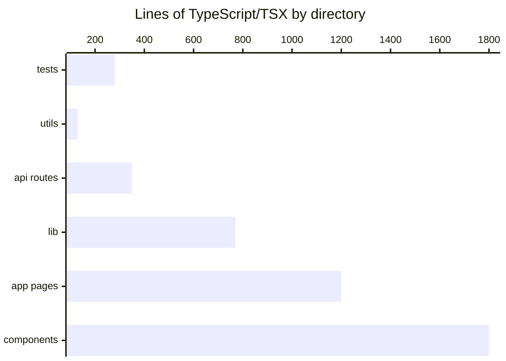

# By the numbers

Data collected on 2026-04-11.

## Size

| Metric | Count |
|---|---|
| TypeScript / TSX source files | 49 |
| CSS files | 1 |
| Lines of TypeScript / TSX | ~4,442 |
| Lines of CSS | 335 |

### Lines by directory

## Activity

- **Total commits:** 20
- **All commits landed on:** 2026-04-11 (the entire codebase was built in a single day)

## AI attribution

20 out of 20 commits (100%) carry a `Co-authored-by: factory-droid[bot]` header. This is the lower bound on AI-assisted work — every commit in the repository was pair-programmed with the bot.

## Complexity hotspots

| File | Lines |
|---|---|
| `src/lib/queries.ts` | 487 |
| `src/components/workout/active-workout.tsx` | 419 |
| `src/components/supplements/manage-stack.tsx` | 263 |
