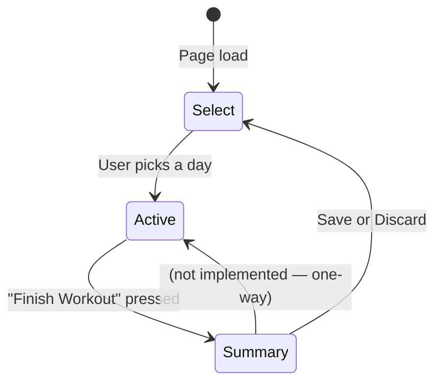
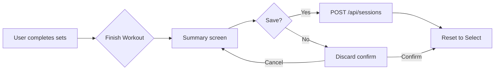

# Workout logger

> Active contributors: Sam

## Purpose

The workout logger (`/workout`) is a client-side multi-phase flow for recording a training session. The user selects a programme day, logs sets for each exercise, reviews a summary, and saves to the database. It uses API routes for data fetching and mutations — no direct Supabase calls.

## Key source files

| File | Role |
|---|---|
| `app/src/app/(app)/workout/page.tsx` | Page — Client Component, manages phase state machine |
| `app/src/components/workout/workout-selector.tsx` | Phase 1: programme day picker |
| `app/src/components/workout/active-workout.tsx` | Phase 2: set logging, rest timer, stopwatch |
| `app/src/components/workout/workout-summary.tsx` | Phase 3: review + save/discard |
| `app/src/components/workout/rest-timer.tsx` | Countdown timer + stopwatch timer components |
| `app/src/components/workout/supplement-reminder.tsx` | Banner showing untaken supplements during workout |
| `app/src/app/(app)/api/programme/route.ts` | GET — fetch programme days / single day with exercises |
| `app/src/app/(app)/api/sessions/route.ts` | POST — save completed session + sets |

## How it works

### Three-phase flow

Phase state is managed via `useState<"select" | "active" | "summary">` in the page component.

### Phase 1 — Select workout

`WorkoutSelector` fetches programme days from `GET /api/programme` on mount. Each day is rendered as an interactive card showing day number, name, and focus. Clicking a day triggers `GET /api/programme?day={n}` to load the full exercise list, then transitions to the active phase.

### Phase 2 — Active workout

`ActiveWorkout` receives the selected `ProgrammeDay` (with exercises) and manages all logging state locally.

**Programme pre-loading**: Working exercises are initialised with `SetEntry[]` arrays sized to the programme's prescribed set count. Rep targets and RPE are pre-filled from the programme data.

**Warmup checklist**: Warmup exercises (`is_warmup === 1`) are rendered as a checkbox list at the top. Checking a warmup toggles it in a `Set<string>` — completed warmups get a strikethrough style.

**Working sets**: Each exercise renders a row per set with inputs for weight, reps, and RPE. Completing a set (✓ button) marks it `done`, dims the row, and triggers the rest timer.

**Superset groups**: Exercises with a `superset_group` value display a gold badge (e.g. "A1", "A2") next to the exercise name.

**Rest timer**: `RestTimer` is a countdown overlay with an SVG circular progress ring. It auto-dismisses on completion or can be skipped. The countdown duration comes from `rest_seconds` on the programme exercise (defaults to 60s).

**Dead hang stopwatch**: Exercises containing "dead hang" (case-insensitive) switch to a time-based UI. Instead of weight/reps inputs, they show a seconds input and a ⏱ button that opens `StopwatchTimer` — a count-up timer that logs `duration_sec` when stopped. Manual time entry is also supported via the seconds input field.

**Supplement reminder**: `SupplementReminder` fetches untaken supplements via `GET /api/supplements` and `GET /api/supplements/log?date={today}`. It renders a dismissible gold-bordered bar with quick-take buttons for each supplement. Taking a supplement POSTs to `/api/supplements/log`.

**Finish confirmation**: The "Finish Workout" button opens a modal confirming the set count. Incomplete sets are noted but not logged.

### Phase 3 — Summary

`WorkoutSummary` displays:
- Stats grid: exercise count, total sets, total volume (reps × weight in lbs)
- Summary table: exercise name, set count, best set (weight × reps or duration), average RPE
- Session notes (if entered)

Two actions:
- **Save to Log** — POSTs to `/api/sessions` with date, day name, programme, block, week, notes, and all logged sets. Resets state on success.
- **Discard** — opens a confirmation modal. Confirming resets all state back to the select phase.

## Cross-references

- Programme data comes from the same tables displayed on the [Programme](./programme.md) page.
- Logged sets feed into the [Dashboard](./dashboard.md) PR board and recent sessions list.
- The supplement reminder links to the [Supplements](./supplements.md) tracking system.
- Logged exercises appear in the [Exercise library](./exercises.md) with aggregated stats.
