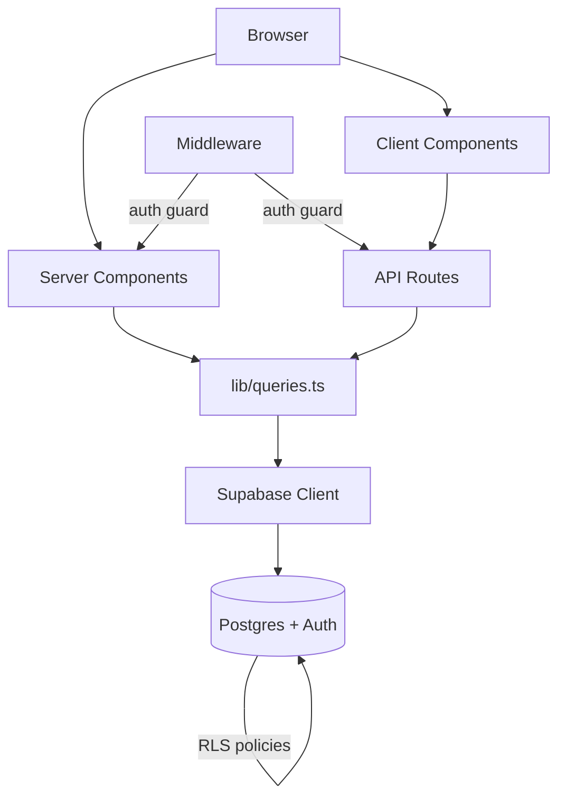

# Architecture

## Data flow

**Server path:** Browser → Next.js Server Components → `lib/queries.ts` → Supabase server client → Postgres.

**Client path:** Browser → Client Components → API routes (`(app)/api/*`) → `lib/queries.ts` → Supabase server client → Postgres.

All database access flows through `lib/queries.ts`, which centralises every Supabase query. Both server components and API route handlers import from this single module.

## Route groups

- **`(app)/`** — Authenticated routes. Wrapped in a layout with sidebar navigation and a fixed status bar. Pages: Dashboard, Workout, Body, Supplements, Programme, Exercises.
- **`(auth)/`** — Login, signup, and auth callback. Standalone pages with no app chrome.

## Auth and middleware

`src/middleware.ts` intercepts every request. Unauthenticated users are redirected to `/login`. The Supabase client in middleware refreshes the session token on each request.

Row-Level Security (RLS) is enabled on all 10 tables. Every policy checks `auth.uid() = user_id`. `BEFORE INSERT` triggers auto-populate the `user_id` column, so client code never sets it manually. The app uses only the publishable key — no service role key is present.

## Key source files

| File | Purpose |
|---|---|
| `src/middleware.ts` | Auth guard — redirects unauthenticated requests to `/login` |
| `src/lib/queries.ts` | All Supabase queries — single source of truth for data access |
| `src/utils/supabase/server.ts` | Creates Supabase client for server components and API routes |
| `src/utils/supabase/client.ts` | Creates Supabase client for client components |
| `src/utils/supabase/middleware.ts` | Creates Supabase client for middleware with session refresh |

## Database tables

10 tables in the `public` schema, all with `user_id UUID` foreign-keyed to `auth.users`:

`sessions`, `sets`, `body_comp`, `measurements`, `working_weights`, `milestones`, `programme_days`, `programme_exercises`, `supplements`, `supplement_log`.
